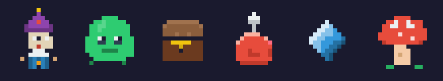

# pixelyuna

Pixel art sprite compiler for game development. Images are just bytes — no image AI, no designers, no npm dependencies.

<p align="center">
  
</p>

Built entirely with Node.js and a from-scratch PNG encoder using only `zlib`.

## How it works

You write `.sprite` files — text files where you draw with characters:

```
name: heart

palette:
  . transparent
  r #e74c3c
  d #c0392b
  w #ffffff

pixels:
  ..rr..rr..
  .rrrr.rrrr.
  rrrwrrrrrdr
  rrrrrrrrrdr
  .rrrrrrrrr.
  ..rrrrrrr..
  ...rrrrr...
  ....rrr....
  .....r.....
```

Then compile to PNG:

```bash
node src/cli.js compile sprites/heart.sprite --out output/ --scale 4
```

That's it. Text in, image out.

## Animations

Add `fps:` and `frame:` sections:

```
name: hero_walk
fps: 6

palette:
  . transparent
  k #1a1a2e
  s #e2d4b7
  b #2c3e50

frame: idle
  ....bbbb....
  ...ssssss...
  ....bbbb....

frame: walk_1
  ....bbbb....
  ...ssssss...
  ...bb..bb...

frame: walk_2
  ....bbbb....
  ...ssssss...
  ..bb....bb..
```

Compile:

```bash
node src/cli.js animate sprites/hero_walk.sprite --out output/ --scale 4
```

Output:
- `hero_walk_strip.png` — horizontal spritesheet strip
- `hero_walk.json` — frame positions and timing metadata
- `hero_walk_preview.html` — open in browser to preview the animation

## Commands

```bash
# Compile one sprite or a whole directory
node src/cli.js compile sprites/hero.sprite --out output/ --scale 4
node src/cli.js compile sprites/ --out output/ --scale 4

# Compile animation
node src/cli.js animate sprites/hero_walk.sprite --out output/ --scale 4

# Build a spritesheet atlas from all sprites
node src/cli.js sheet sprites/ --out output/spritesheet.png --scale 4
```

### Options

| Flag | Description | Default |
|---|---|---|
| `--out <path>` | Output directory or file | `./output/` |
| `--scale <n>` | Nearest-neighbor upscale factor | `1` |
| `--columns <n>` | Columns in spritesheet | auto |
| `--no-preview` | Skip HTML preview generation | preview on |

## .sprite format reference

```
# Comments start with #
name: sprite_name
fps: 8                  # only for animations

palette:
  . transparent         # . is always transparent
  k #1a1a2e             # single char → hex color
  r #ff4444
  w #fff                # shorthand hex works too

# Static sprite:
pixels:
  ..xxxx..
  .xrrrrx.

# Animated sprite (use frame: instead of pixels:):
frame: idle
  ..xxxx..
  .xrrrrx.

frame: walk_1
  .xrrrrx.
  ..xxxx..
```

Multiple sprites in one file, separated by `---`.

## Requirements

- Node.js 18+
- Zero npm dependencies

## Why

Pixel art is not art generation — it's data. A 16x16 sprite is 256 color values. Any code-writing tool can produce that. No Stable Diffusion, no DALL-E, no Photoshop. Just bytes.

This project proves that pixel art for games can be produced entirely through code, making it accessible to anyone who can describe what they want.
